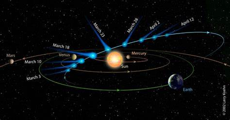

## §1.1 Ons zonnestelsel

### §1.1.1 De plaats van de Aarde in ons zonnestelsel
Ons zonnestelsel bestaat allereerst uit de Zon zèlf plus 9 planeten. Onze Zon vormt 99,86% van de massa van ons zonnestelsel. De planeten vormen bij elkaar slechts 0,135% van de totale massa. Het overige minieme deel vormen de manen, kometen, meteoroiden enz. Die planeten beschrijven (op verschillende afstanden van de Zon) min of meer cirkelvormige banen rond de Zon. Vanuit het noorden gezien, bewegen ze tegen de wijzers van de klok in. De rotatie om de eigen as geschiedt (uitgezonderd Venus en Uranus) in dezelfde richting. Ook de zon zèlf roteert in deze richting.
Uitgaande van de Zon komen we achtereenvolgens tegen: Mercurius, Venus, Aarde, Mars, Jupiter, Saturnus, Uranus, Neptunus en Pluto. Hoe dichter een planeet bij de Zon staat, hoe sneller hij zich rond de Zon beweegt. Mercurius draait één keer om de Zon in 88 dagen. De Aarde doet er 365 dagen over (= 1 jaar), Pluto maar liefst 247 jaar.  
De afstand van de aarde tot de zon is zo'n 150 miljoen kilometer. Dit wordt 1 ASTRONOMISCHE EENHEID genoemd (= 1 AE).  
Alle gegevens over afstanden, omlooptijden, massa's enz. staan in BINAS tabel 31.

Alle planeten bevinden zich nagenoeg in één plat vlak rond de Zon. Dit vlak heet het **eclipticavlak**.

``` {figure} ../figures/PlanetenEclipticavlak.jpg
---
width: 80%
name: Planeten in het Eclipticavlak
---
Hier is een diagram van de locatie van de planeten met hun baaninclines - de hoeken in graden waarmee de baan van een planeet rond de zon gekanteld is ten opzichte van het eclipticavlak.
``` 

### §1.1.2 Wat bevindt er zich verder in ons zonnestelsel? 
Tussen Mars en Jupiter bevindt zich een grote ruimte. Deze ruimte is echter niet leeg. Er bevindt zich een gordel van **planetoïden**: kleine brokken steen en ijs, meestal met een diameter kleiner dan 50 km, die in een brede ring rond de Zon draaien. De grootst bekende planetoïde heet Ceres en heeft een doorsnede van 800 km.

Soms nemen we ook kleinere brokken waar die in onze atmosfeer komen en door wrijving verbranden. Dit heten **meteoroïden**. Deze meteoroïden komen in groepen voor en bewegen ook in grote banen rond de Zon. Sommigen komen in onze atmosfeer en verbranden. Je ziet dan een lichtende streep aan de hemel. Dit verschijnsel wordt ook wel een 'vallende ster' genoemd, wat dus eigenlijk geen goede term is.

Soms zijn meteoroïden zó goot dat ze niet geheel verbranden in de atmosfeer. In dat geval noemen we ze meteorieten. Ze vallen dan te pletter op de Aarde en vormen kraters die enorme afmetingen kunnen hebben. De grootste krater werd ontdekt in Wilkes Land, Antarctica. De krater is ontstaan door een meteoriet van 13 miljard ton die met een snelheid van 70.000 km/s(!) op Aarde terecht kwam. De bekendste krater bevindt zich in Arizona met een diameter van 1265 meter. Hij is zo'n 25.000 jaar geleden ontstaan door een meteoriet van 2 miljoen ton.

De hele kleine meteoroïden worden zó sterk geremd door de atmosfeer, dat hun temperatuur niet hoog genoeg wordt om te verbranden. Ze zijn microscopisch van grootte en worden micro-meteorieten genoemd. Ze bedekken de Aarde als een laag stof. Vermoedelijk komen er miljoenen tonnen per jaar op Aarde neer.

Verder worden we soms verrast door een bezoek van een **komeet**.	
Kometen worden ook 'Haarsterren' genoemd (Komètès is Grieks voor langharig) maar die naam is onjuist. Ook een komeet is geen ster maar een brok materie, bestaande uit steen, metaal, stof, ijs enz. Kometen bewegen in sterk excentrische banen rond de Zon (zie FIGUUR 2).



``` {figure} ../figures/Komeet.jpg
---
width: 80%
name: Komeet
---
Gedeelte van de baan van een komeet
``` 	
